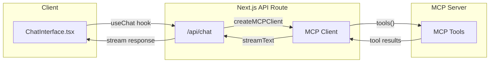

# AI Agent Chat Interface with MCP Tool Calling

## Architecture Overview



## Key Dependencies to Add

```bash
bun add @ai-sdk/mcp
```

The `@ai-sdk/mcp` package provides:

- `createMCPClient` - Creates an MCP client connection
- Transport options: HTTP, SSE, or stdio

## Implementation Steps

### 1. Update API Route ([frontend/src/app/api/chat/route.ts](frontend/src/app/api/chat/route.ts))

Transform the existing route to:

- Initialize MCP client using `createMCPClient` with HTTP or SSE transport
- Fetch available tools from the MCP server via `client.tools()`
- Pass tools to `streamText` for the AI to use
- Handle cleanup with `onFinish` callback to close the client

Key code pattern:

```typescript
import { createMCPClient } from '@ai-sdk/mcp';
import { streamText, convertToModelMessages, UIMessage, stepCountIs } from 'ai';
import { openai } from '@ai-sdk/openai';

export async function POST(request: Request) {
  const { messages }: { messages: UIMessage[] } = await request.json();

  const mcpClient = await createMCPClient({
    transport: {
      type: 'sse', // or 'http'
      url: process.env.MCP_SERVER_URL!,
    },
  });

  const tools = await mcpClient.tools();

  const result = streamText({
    model: openai('gpt-4o'),
    messages: await convertToModelMessages(messages),
    tools,
    stopWhen: stepCountIs(5), // Allow multi-step tool calls
    onFinish: async () => await mcpClient.close(),
    onError: async () => await mcpClient.close(),
  });

  return result.toUIMessageStreamResponse();
}
```

### 2. Update Environment Config ([frontend/src/config/env.ts](frontend/src/config/env.ts))

Add MCP server configuration:

- `MCP_SERVER_URL` - URL of the MCP server (HTTP or SSE endpoint)
- Optional: `MCP_SERVER_AUTH` - Authorization header if needed

### 3. Update ChatInterface Component ([frontend/src/components/chat/ChatInterface.tsx](frontend/src/components/chat/ChatInterface.tsx))

Enhance to render tool invocations:

- Check `message.parts` for tool-specific types (e.g., `tool-<toolName>`)
- Display loading state when `part.state === 'input-available'`
- Render tool results when `part.state === 'output-available'`
- Create reusable components for common tool result displays

Key code pattern for rendering tool parts:

```typescript
{message.parts.map((part, index) => {
  switch (part.type) {
    case 'text':
      return <p key={index}>{part.text}</p>;
    case 'tool-searchArticles': // Example MCP tool
      return part.state === 'output-available' 
        ? <ArticleResults key={index} data={part.output} />
        : <LoadingSpinner key={index} label="Searching articles..." />;
    default:
      return null;
  }
})}
```

### 4. Create Tool Result Components

Create UI components in `frontend/src/components/chat/tools/` for rendering specific tool outputs:

- Generic `ToolResult.tsx` for displaying JSON tool outputs
- Specialized components as needed for specific MCP tools

### 5. Add Types ([frontend/src/types/index.ts](frontend/src/types/index.ts))

Add TypeScript types for:

- MCP tool inputs/outputs
- Extended message part types

## Configuration Required

Add to `.env` (or `.env.local`):

```
MCP_SERVER_URL=http://localhost:3001/sse  # Your MCP server endpoint
```

## Notes

- The MCP client connection is created per-request and closed after streaming completes
- `stepCountIs(5)` allows the AI to make up to 5 consecutive tool calls in one turn
- Tool names from MCP servers become `tool-<name>` part types on the client
- For local development, you'll need an MCP server running (can be mocked initially)