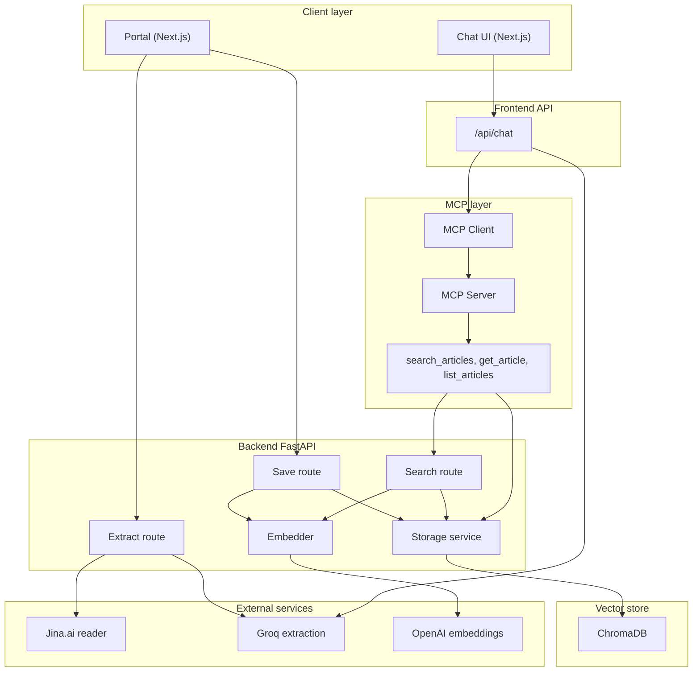
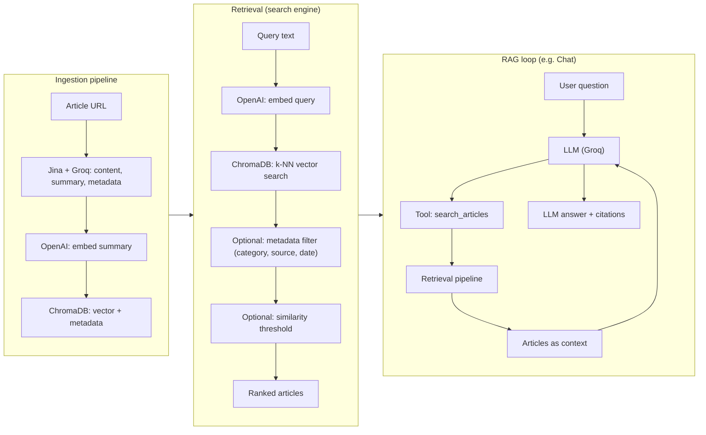

# MCPress

**Journalist-written news, natively accessible to LLMs.** A system that lets AI agents search and cite licensed news articles via [MCP](https://modelcontextprotocol.io/) (Model Context Protocol)—without scraping.

- **For news media:** Publish articles once; content is stored in an **LLM-native format** (embeddings + structured metadata) and is **accessible through our custom search engine**—semantic retrieval (vector similarity) that powers **RAG** (retrieval-augmented generation) for AI agents. The design supports extending to **hybrid** search (e.g. semantic + keyword) for richer retrieval. Enables new distribution and monetization (e.g. API access).
- **For AI agents:** Search over real articles via our RAG-ready engine, full content by ID, filters by category/source/author. Access via MCP server or REST API.

---

## Architecture

| Part | Role |
|------|------|
| **Frontend** (Next.js) | Portal to add articles (URL → extract → save). Chat UI that uses the LLM + MCP tools to search and cite articles. |
| **Backend** (FastAPI) | Extract article content (Jina.ai), metadata + summary (Groq), embeddings (OpenAI). Store in ChromaDB. REST API: extract, save, search, get, list. |
| **MCP Server** (FastMCP) | Exposes `search_articles`, `get_article`, `list_articles` to MCP clients. Calls the backend for embeddings and search. |

Articles are stored locally in **ChromaDB** (no Supabase/Postgres). Search is semantic (embedding similarity); the pipeline is RAG-ready and can be extended with hybrid (e.g. keyword) retrieval.

### System architecture (Mermaid)



### Search engine (Mermaid)



---

## Quick Start

### Prerequisites

- **Node.js** 18+ (frontend)
- **Python** 3.12+ and [uv](https://docs.astral.sh/uv/) (backend, MCP server)
- API keys: **Groq**, **OpenAI** (and optionally **Jina** for reader)

### 1. Backend

```bash
cd backend
cp .env.example .env   # set GROQ_API_KEY, OPENAI_API_KEY
uv sync
uv run uvicorn app.main:app --reload
```

API: `http://localhost:8000` · Docs: `http://localhost:8000/docs`

### 2. MCP Server (for chat tools)

In a second terminal:

```bash
cd mcp-server
cp .env.example .env   # MCPRESS_BACKEND_URL=http://localhost:8000
uv sync
MCP_TRANSPORT=http uv run python -m mcpress
```

Listens on `http://localhost:8001` by default.

### 3. Frontend

In a third terminal:

```bash
cd frontend
cp .env.example .env   # GROQ_API_KEY, NEXT_PUBLIC_API_URL, MCP_SERVER_URL, etc.
npm install
npm run dev
```

App: `http://localhost:3000`

- **Portal** (`/portal`): paste a article URL → extract → edit → save. Articles are embedded and stored in Chroma.
- **Chat** (`/chat`): ask questions; the model uses MCP tools to search articles and cite them with clickable links.

---

## Project Layout

```
MCPress/
├── backend/          # FastAPI + ChromaDB, extract/save/search articles
│   ├── app/
│   ├── scripts/      # populate_articles.py, check_chroma.py
│   └── README.md
├── frontend/         # Next.js: portal + chat (Vercel AI SDK, MCP client)
│   ├── src/
│   └── README.md
├── mcp-server/       # FastMCP: search_articles, get_article, list_articles
│   ├── src/mcpress/
│   └── README.md
├── .env.example      # Root env reference (each part has its own .env)
├── DEPLOYMENT.md     # Vercel + backend deployment
└── requirements.md   # High-level product/tech notes
```

Each of `backend/`, `frontend/`, and `mcp-server/` has its own `.env.example`; copy to `.env` and fill in keys and URLs.

---

## Environment (overview)

| Where | What |
|-------|------|
| **backend/.env** | `GROQ_API_KEY`, `OPENAI_API_KEY`, `CHROMA_PERSIST_DIR` (optional) |
| **mcp-server/.env** | `MCPRESS_BACKEND_URL` (backend API URL) |
| **frontend/.env** | `NEXT_PUBLIC_API_URL`, `GROQ_API_KEY`, `GROQ_MODEL`, `MCP_SERVER_URL`, `MCP_SERVER_TRANSPORT` |

See each directory’s `.env.example` for full lists.

---

## Features

- **Article pipeline:** URL → fetch (Jina) → extract title/author/date/summary/keywords/category (Groq) → embed summary (OpenAI) → store in Chroma.
- **Semantic search:** Query text is embedded; backend returns articles by similarity (optional threshold).
- **MCP tools:** `search_articles(query, limit, …)`, `get_article(article_id)`, `list_articles(category, media_source, …)`.
- **Chat:** Streamed replies with tool use; citations as markdown links `[title](url)`.

---

## Docs

- [Backend README](backend/README.md) – API, Chroma, scripts, env
- [Frontend](frontend/) – Next.js app; chat uses `/api/chat` + MCP
- [MCP Server README](mcp-server/README.md) – tools, HTTP vs stdio, connecting Claude/Cursor
- [Deployment](DEPLOYMENT.md) – Vercel (frontend), backend elsewhere

---

## License

MIT
